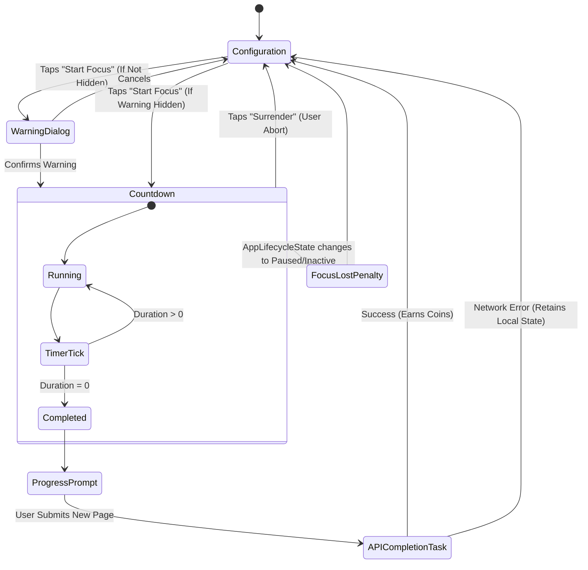

# Focus Timer Feature Spec

## Overview
The Focus Timer acts as the core "game loop" of the app. It challenges the user to commit to a period of distraction-free reading, tying their real-world progress to in-game rewards (coins).

## User Stories

### US-9: Timer Configuration
**As a** reader starting a new book,
**I want to** select the book I'm reading and set a focus duration (custom or preset),
**So that** I have a defined goal for my reading session.

### US-10: Distraction Penalty
**As a** reader focusing on my book,
**I want** the system to automatically fail the timer if I switch applications or minimize the screen,
**So that** I am heavily incentivized to stay away from the screen and actually read.

### US-11: Recording Progress
**As a** reader who successfully finished a session,
**I want to** be prompted to input my new page number,
**So that** the app tracks my progression through the current tome.

### US-12: Earning Rewards
**As a** successful reader,
**I want to** earn coins scaled to how long I focused,
**So that** I feel fairly compensated for my distraction-free time.

## Technical Specifications

### Core Components
- **Focus Timer Screen (`focus_timer_screen.dart`)**: A StatefulWidget implementing `WidgetsBindingObserver`. It now autonomously fetches the user's active books list upon initialization.
- **Add Book Dialog (`add_book_dialog.dart`)**: A reusable widget extracted to facilitate seamless onboarding. If a user enters the Focus Timer screen with no active books, this dialog is automatically triggered to ensure they can start reading immediately.
- **Focus Lifecycle Management**: Logic that aborts the timer and forfeits rewards if the UI is hidden or backgrounded.

### Lifecycle State Management Diagram

### API Mappings

| Feature | Endpoint | Method | Payload / Details |
|---------|----------|--------|-------------------|
| Submit Session Data | `/focus_timer_complete` | POST | `{'book_id': 123, 'minutes': 15, 'current_page': 50}` |

