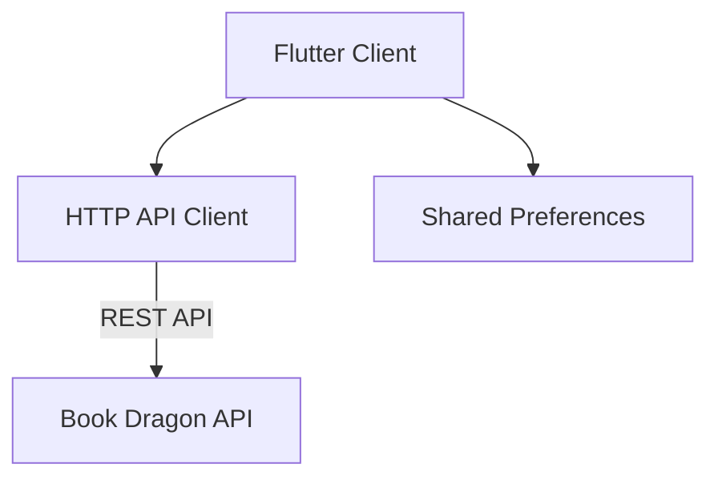
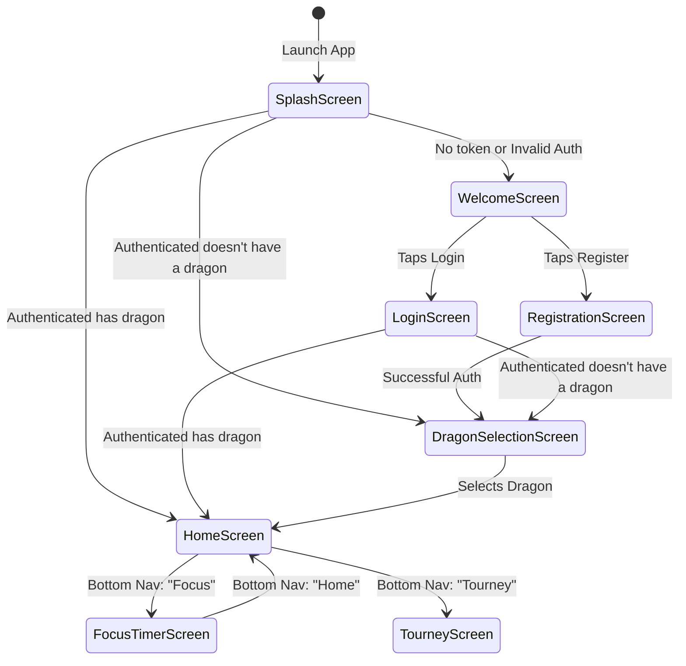
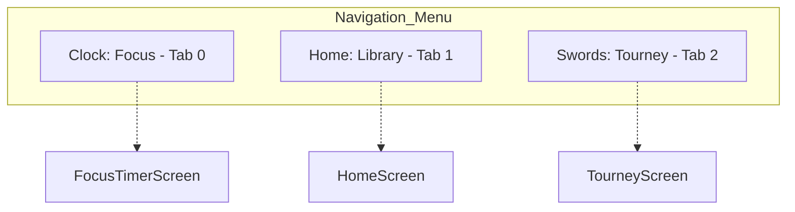

# Book Dragon Client Overview

## Introduction
Book Dragon is a gamified reading companion mobile application built to encourage reading through progress tracking and rewards. The application pairs the user with a virtual dragon companion that grows as the user reads.

## Core Technologies
*   **Framework**: Flutter (Dart)
*   **Styling**: Material Design with a custom dark, medieval-themed UI (`app_theme.dart`).
*   **Networking**: Standard `http` package for RESTful JSON API interactions.
*   **Storage**: `shared_preferences` for local data persistence (e.g., authentication tokens).
*   **Typography**: `google_fonts` (`MedievalSharp` for display headings, `Rosarivo` for body text).

## System Architecture

The application follows a standard Flutter single-page application structure relying on local `State` orchestration (`StatefulWidget`) and direct asynchronous REST API calls. 

## Application Navigation Flow

The user journey is straightforward, heavily centered on whether the user is authenticated and whether they have initialized a dragon.

## Navigation Menu

