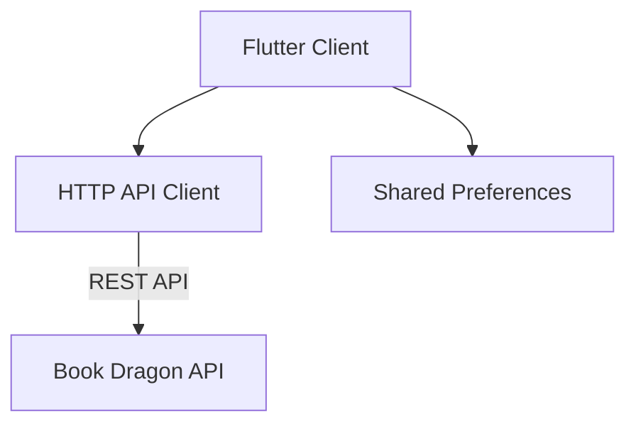
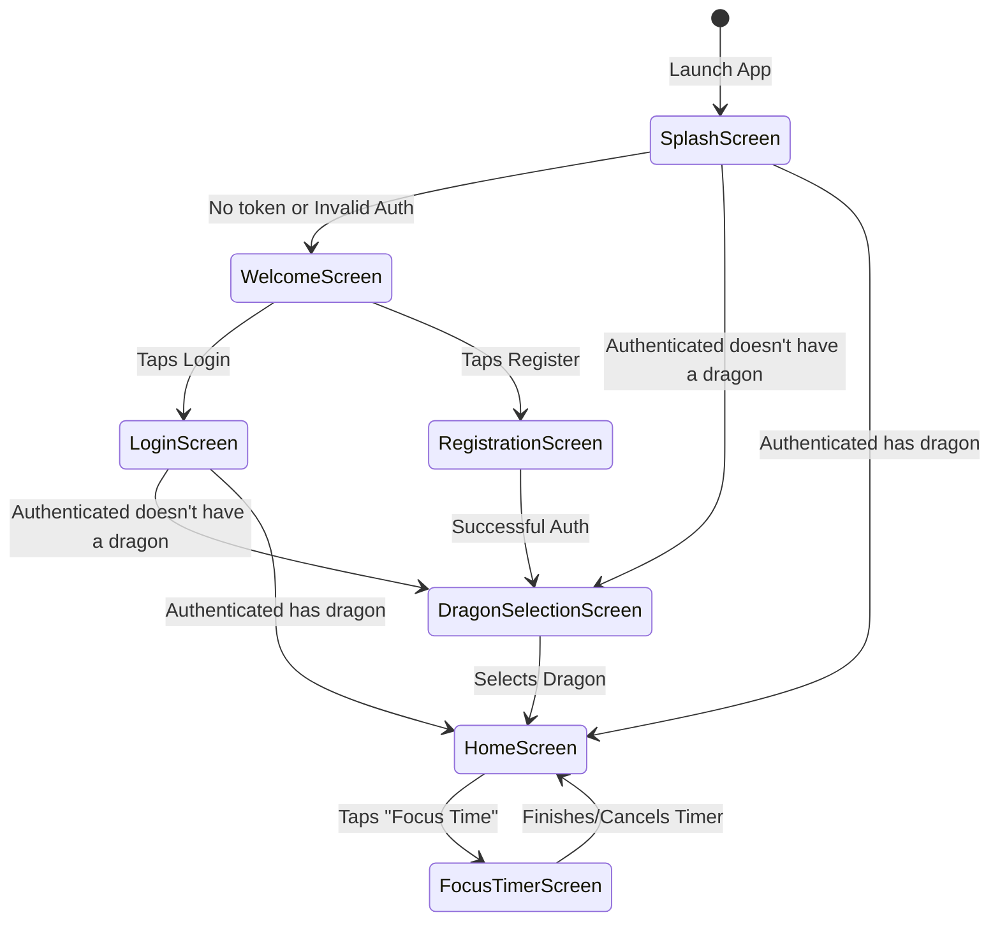

# Book Dragon Client Overview

## Introduction
Book Dragon is a gamified reading companion mobile application built to encourage reading through progress tracking and rewards. The application pairs the user with a virtual dragon companion that grows as the user reads.

## Core Technologies
*   **Framework**: Flutter (Dart)
*   **Styling**: Material Design with a custom dark, medieval-themed UI (`app_theme.dart`).
*   **Networking**: Standard `http` package for RESTful JSON API interactions.
*   **Storage**: `shared_preferences` for local data persistence (e.g., authentication tokens).
*   **Typography**: `google_fonts` (`MedievalSharp` for display headings, `Rosarivo` for body text).

## System Architecture

The application follows a standard Flutter single-page application structure relying on local `State` orchestration (`StatefulWidget`) and direct asynchronous REST API calls. 



## Application Navigation Flow

The user journey is straightforward, heavily centered on whether the user is authenticated and whether they have initialized a dragon.




## Challenge Flow

```mermaid
challenge TD
    subgraph Tourney_Hall
        Start[User Enters Tourney Hall] --> CheckActive{Is a Challenge<br/>Active?}

        CheckActive -- No --> NoChallenge[State: No Challenge Active]
        NoChallenge --> NoDragonInfo[Elements:<br/>- Plus button on top right<br/>- No Dragon]
        NoDragonInfo --> ClickPlus[Click Plus Button]
        ClickPlus --> OpenForm1[Opens Form 1:<br/>Invite Link & Create Option]
        
        OpenForm1 --> OptionCreate[Select: Create your own challenge]
        OptionCreate --> OpenForm2[Opens Form 2:<br/>Length Options & Daily Duration]
        OpenForm2 --> DefineAndCreate[Define parameters & click Create]
        DefineAndCreate --> SetChallengeActive[Challenge Becomes Active]
        
        OpenForm1 --> UseInvite[Submit Invite / Join]
        UseInvite --> SetChallengeActive

        CheckActive -- Yes --> ChallengeActiveState[State: Challenge Active]
        SetChallengeActive --> ChallengeActiveState
        ChallengeActiveState --> ActiveElements[Elements:<br/>- Dragon flying<br/>- No Plus button<br/>- Title & Progress Bar]

        ActiveElements --> DailyCheck{Reading completed<br/>for the day?}

        DailyCheck -- No --> ReadingNotDone[State: Reading Not Completed]
        ReadingNotDone --> KnightInfo[Show Knight with<br/>cycling taunts bubble]
        KnightInfo --> UserReads[User Reads 5 mins / Complies]
        UserReads --> CompleteForDay[Reading Marked Complete]

        DailyCheck -- Yes --> CompleteForDay
        CompleteForDay --> GoalCheck{Overall Duration<br/>Met?}

        GoalCheck -- No --> WaitNextDay[Wait for next day]
        WaitNextDay --> DailyCheck

        GoalCheck -- Yes --> ChallengeEnds[Challenge Ends]
        ChallengeEnds --> NoChallenge
    end

    subgraph Navigation_Menu
        Clock[Clock - Bottom Left]
        Home[Home - Center]
        Swords[Swords Crossing - Bottom Right]
    end

    Swords -.-> Tourney_Hall
```
